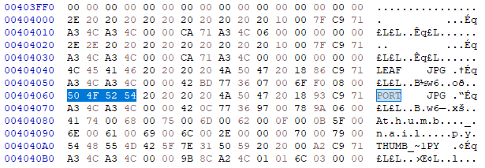

## 저수준 파일 시스템 구조 분석을 통한 고급 프로그래밍 실습

- 저수준 파일 시스템 구조 분석을 통한 고급 프로그래밍 실습
- 2024.1.18 ~ 2024.1.20
- 파일 시스템은 컴퓨터의 중추적인 부분을 담당합니다. 파일 시스템에는 여러 가지 정보들이 저장되기 때문에, 파일 시스템 내에 숨겨진 정보를 분석하여 복구하는 것이 가능합니다. FAT32는 Microsoft에서 개발한 파일 시스템 중 하나로 FAT32는 32비트 파일 할당 테이블을 사용하여 파일 및 디렉토리를 관리하며, 이로써 더 큰 디스크 공간과 파일 크기를 지원합니다. FAT32는 파일과 디렉토리의 메타데이터 및 할당 정보를 저장하는 데 사용되는 파일 할당 테이블을 제공합니다. 이를 통해 파일 시스템은 파일의 위치와 크기를 신속하게 찾을 수 있습니다.
저수준 파일 시스템 구조 분석을 통한 고급 프로그래밍 실습에서는 FAT32 파일 시스템을 이용하여 삭제된 파일들을 복구했습니다. 파일 할당 테이블의 간단한 구조로 인해 데이터 복구가 상대적으로 쉽습니다. 삭제된 파일의 흔적을 찾거나 손상된 파일 시스템을 복구하는 데 도움이 됩니다. 
- Supported by GMDSOFT

- 코드 설명은 다음과 같습니다. 

    Superblock 클래스:
        FAT32 파일 시스템의 슈퍼블록 정보를 저장하는 클래스입니다.
        파일 시스템의 구조와 관련된 여러 속성 및 계산된 값들을 제공합니다.

    FATArea 클래스:
        FAT32 파일 시스템의 FAT 영역 정보를 저장하는 클래스입니다.
        파일 시스템의 클러스터 관련 정보를 제공합니다.

    DirEntry 클래스:
        디렉터리 엔트리 정보를 저장하는 클래스입니다.
        파일 또는 디렉터리의 속성, 크기, 이름 등을 제공하며, 파일이 삭제되었는지 여부 등을 확인하는 함수를 제공합니다.

    Node 클래스:
        파일이나 디렉터리를 나타내는 클래스로, 추출된 정보를 저장합니다.
        파일 또는 디렉터리의 타입, 삭제 여부, 크기, 이름, 물리적인 데이터의 위치 등을 저장합니다.

    to_node 함수:
        DirEntry 객체를 Node 객체로 변환하는 함수입니다.

    Fat32 클래스:
        FAT32 파일 시스템을 분석하고, 디렉터리와 파일 정보를 추출하는 클래스입니다.
        주어진 FAT32 이미지 파일을 읽어 Superblock, FATArea 클래스 등을 활용하여 파일 및 디렉터리 정보를 추출합니다.

    메인 함수:
        주어진 FAT32 이미지 파일을 처리하고, 해당 파일 시스템의 디렉터리와 파일 정보를 추출합니다.

- 실행 예시

    FAT32 binary file을 분석합니다. 처음에 Superblock을 이용하여 클러스터(각각 파일 사이즈의 정보를 가지고 있는 Area), 파일이 직접 저장되어 있는 부분의 시작 위치를 파악합니다. 이후 이를 이용하여 파일이 위치로 이동해, 파일의 이름, 확장자 등을 확인하여 파일을 복구합니다. 삭제된 파일도 복구 가능합니다. 

    예시: 

    - Binary File 예시: 

    - 보이는 LEAF, PORT, 파이썬 파일 복구 예시

    
    
    
    [파이썬 파일](./result/THUMB_~1.PY)
